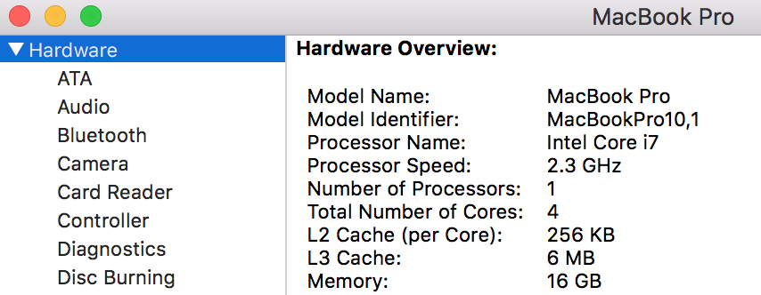

# Objectives
- Load, filter, and transform datasets using the Polars library  
- Perform efficient group-based operations and aggregations   
- Leverage parallelism for faster data processing  
- Export and save processed data to various file formats (CSV, Parquet, etc.)

## Why use Polars for Data Analysis

Polars is a high-performance DataFrame library designed for efficient data manipulation and analysis. Built in Rust, Polars offers seamless integration with Python, R, and Node.js, providing a versatile tool for data professionals. [Learn more](https://docs.pola.rs/).

### Key Features:

- Speed and Performance: Polars is engineered for speed, often outperforming other DataFrame libraries in various benchmarks. [See benchmarks](https://pola.rs/posts/benchmarks/).
- **Parallelism:** Polars automatically utilizes all available CPU cores, enhancing performance without additional configuration.

- **Lazy Evaluation:** Polars supports lazy evaluation, optimizing query execution by deferring computations until necessary. [Migration from pandas](https://docs.pola.rs/user-guide/migration/pandas/).
- **Out-of-Core Processing:** Polars can handle datasets larger than available memory through its streaming API, enabling efficient processing without loading all data into RAM.

- **Interoperability:** Polars adheres to the Apache Arrow memory format, facilitating zero-copy data sharing with other tools and libraries.

## Jupyter Notebooks and Datasets

In order, the notebooks used are: 

- 01

## Learn by doing portion of the lecture

Part of this talk is inspired from the following: 

- [The Cost of Financing a Car](https://medium.com/p/c00997f1aee) by Michael Galarnyk
- [Python for Data Visualization (LinkedIn Learning)](https://www.linkedin.com/learning-login/share?account=2163426&forceAccount=false&redirect=https%3A%2F%2Fwww.linkedin.com%2Flearning%2Fpython-for-data-visualization-2023%3Ftrk%3Dshare_ent_url%26shareId%3DDGcmsACFQiarZzlJgzHfzQ%253D%253D) by Michael Galarnyk 
- [How to Speed Up Pandas with Modin (Towards Data Science)](https://medium.com/towards-data-science/how-to-speed-up-pandas-with-modin-84aa6a87bcdb) by Michael Galarnyk
- [Python Polars: A Lightning-Fast DataFrame Library](https://realpython.com/polars-python/) by Harrison Hoffman

